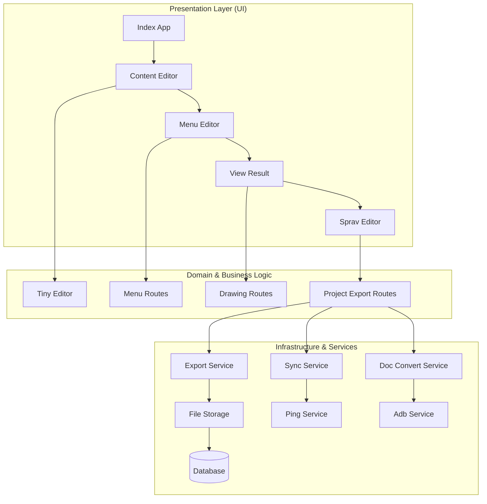
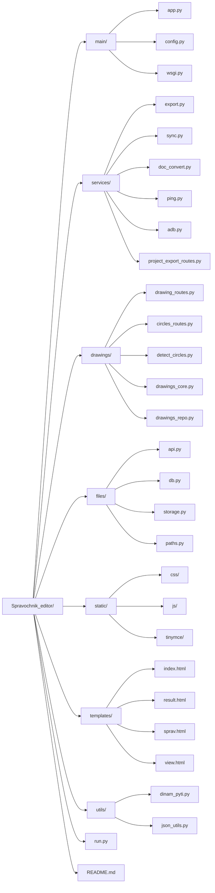

## ИИ-сбор справочника через Ollama

Для локального или сетевого Ollama-сервера создайте `.env` в корне проекта:

```env
OLLAMA_BASE_URL=http://192.168.6.39:11434
OLLAMA_MODEL=qwen3:8b
AI_MAX_DOCS=50
AI_MAX_CHARS_PER_DOC=4000
AI_OLLAMA_TIMEOUT=1200
AI_NUM_PREDICT=8192
```

Проверка доступности Ollama:

```powershell
Invoke-RestMethod http://192.168.6.39:11434/api/tags
```

# Smart ED - Directory Constructor System

Корпоративная система для создания, управления и публикации справочников различного типа. Smart ED предоставляет удобный конструктор для структурирования информации, управления контентом и публикации справочников в различных форматах.

Проект представляет собой полнофункциональную платформу для создания справочной информации, позволяющую специалистам эффективно организовывать знания в виде структурированных справочников. Система обеспечивает полный цикл работы со справочниками: от проектирования структуры до публикации и синхронизации с внешними системами.

---

## 📘 Документация проекта

В данном разделе приведено расширенное описание ключевых технологических узлов системы.

| Раздел | Описание |
|--------|----------|
| 🏗 Архитектура системы | Описание уровней приложения и взаимодействия компонентов |
| 📝 Редактор контента | Технические детали редактирования и визуализации справочников |
| 🔄 Механизмы синхронизации | Алгоритмы обмена данными и стратегия сохранения изменений |
| 📊 Структура базы данных | Схема хранения локальных данных и метаданных |
| 🔌 API Документация | Описание взаимодействия с backend-частью |
| 📂 Структура проекта | Подробное дерево каталогов и назначение модулей |

### Подробное описание разделов

#### 🏗 Архитектура системы
Приложение построено на принципах **Clean Architecture** с использованием современных подходов к разработке.
- **Presentation Layer:** Использует шаблоны MVC/MVT для обновления интерфейса и управления пользовательским опытом.
- **Business Logic Layer:** Содержит бизнес-логику управления справочниками и правила валидации содержимого.
- **Data Layer:** Реализует паттерн **Repository**, который выступает «единым источником истины», координируя данные из локальной базы данных и удаленного API. Такая структура позволяет легко подменять сетевой клиент или базу данных без изменения пользовательского интерфейса.

#### 📝 Редактор контента
Мощный редактор для создания и управления содержимым справочников.
- **Редактирование:** Интеграция с TinyMCE для WYSIWYG-редактирования текстового содержимого справочников.
- **Визуализация:** Отрисовка справочников происходит с использованием HTML/CSS с возможностью предварительного просмотра в реальном времени.
- **Производительность:** Реализована оптимизация загрузки больших справочников с использованием lazy loading и кэширования, что позволяет эффективно работать с объемными документами.

#### 🔄 Механизмы синхронизации
Реализована стратегия **синхронизации данных**, позволяющая работать как онлайн, так и offline.
- **Синхронизация:** Модуль синхронизации обеспечивает согласованность данных между клиентом и сервером.
- **Экспорт:** Система поддерживает различные форматы экспорта справочников (HTML, PDF, DOCX).
- **Обновления:** При подключении к сети система синхронизирует изменения, внесенные другими пользователями.

#### 📊 Структура базы данных
Локальное хранилище на базе **SQLAlchemy** спроектировано для обеспечения целостности данных.
- **Связи:** Таблицы сущностей справочника жестко связаны с конкретными проектами и версиями (`project_id`, `version_id`), что предотвращает появление «сиротских» записей при обновлении справочника.
- **Медиа-данные:** В БД хранятся пути к изображениям и метаданные их состояния (загружено/ожидает), а сами файлы кэшируются во внутреннем хранилище.

#### 🔌 API Документация
Взаимодействие с сервером (на базе FastAPI/Flask) осуществляется по протоколу HTTP/HTTPS с возможной авторизацией.
- **Безопасность:** Каждый запрос может сопровождаться токенами аутентификации.
- **Форматы:** Обмен данными происходит в JSON, а передача файлов и медиа — через Multipart-запросы.
- **Стабильность:** Сетевой слой включает механизмы повторных попыток и адаптивные тайм-ауты.

#### 📂 Структура проекта
Исходный код организован по функциональным модулям, что упрощает навигацию:
- `main/`: Основные точки входа и конфигурация приложения.
- `services/`: Модули синхронизации, экспорта и вспомогательных сервисов.
- `drawings/`: Модули для работы с чертежами и графическими элементами.
- `files/`: Слой работы с файловой системой и хранилищем.
- `static/`: Статические файлы (CSS, JavaScript, изображения).
- `templates/`: HTML-шаблоны для веб-интерфейса.
- `utils/`: Вспомогательные утилиты и вспомогательные функции.

---

## Визуализация архитектуры

### Схема взаимодействия компонентов


---

## Пайплайн работы и синхронизации

1. **Инициализация проекта:** Создание нового справочника или открытие существующего.
2. **Редактирование контента:**
   - Редактирование структуры справочника (меню, разделы).
   - Добавление и редактирование содержимого разделов.
   - Вставка изображений, чертежей и других медиа-элементов.
3. **Предварительный просмотр:** Просмотр справочника в формате, максимально приближенном к финальному.
4. **Экспорт/публикация:** Сохранение справочника в различных форматах (HTML, PDF, DOCX и др.).
5. **Синхронизация:** При необходимости синхронизация с центральным сервером или другим хранилищем.

---

## Структура проекта

### 📁 Дерево каталогов
```
Spravochnik_editor/
├── main/
│   ├── app.py           # Основной точка входа приложения
│   ├── config.py        # Конфигурация приложения
│   └── wsgi.py          # WSGI конфигурация
├── services/
│   ├── export.py        # Сервис экспорта справочников
│   ├── sync.py          # Сервис синхронизации
│   ├── doc_convert.py   # Конвертация документов
│   ├── ping.py          # Диагностика соединения
│   ├── adb.py           # Вспомогательные утилиты
│   └── project_export_routes.py # Маршруты экспорта
├── drawings/
│   ├── drawing_routes.py # Маршруты для чертежей
│   ├── circles_routes.py # Маршруты для круговых диаграмм
│   ├── detect_circles.py # Обнаружение кругов
│   ├── drawings_core.py  # Ядро обработки чертежей
│   └── drawings_repo.py  # Репозиторий чертежей
├── files/
│   ├── api.py           # API для работы с файлами
│   ├── db.py            # Работа с базой данных файлов
│   ├── storage.py       # Хранилище файлов
│   └── paths.py         # Управление путями к файлам
├── static/
│   ├── css/             # Стилевые файлы
│   ├── js/              # JavaScript файлы
│   └── tinymce/         # TinyMCE редактор
├── templates/
│   ├── index.html       # Главная страница
│   ├── result.html      # Страница результата
│   ├── sprav.html       # Страница справочника
│   └── view.html        # Страница просмотра
├── utils/
│   ├── dinam_pyti.py    # Вспомогательные функции Python
│   └── json_utils.py    # Утилиты для работы с JSON
├── run.py               # Файл запуска приложения
├── README.md            # Документация проекта
└── .gitignore           # Игнорируемые файлы Git
```

### Mermaid-визуализация структуры


---

## Структура базы данных

| Таблица | Описание | Основные поля |
|---------|----------|---------------|
| `projects` | Проекты справочников | `id, name, created_at, updated_at, config` |
| `sections` | Разделы справочников | `id, project_id, title, content, order_index` |
| `menu_items` | Элементы меню | `id, project_id, parent_id, title, url, order` |
| `files` | Загруженные файлы | `id, filename, filepath, size, upload_date, project_id` |
| `users` | Пользователи системы | `id, username, password_hash, role, created_at` |

---

## API Взаимодействие

| Метод | Эндпоинт | Описание |
|-------|----------|----------|
| `GET` | `/api/projects` | Получение списка проектов |
| `POST` | `/api/projects/create` | Создание нового проекта |
| `PUT` | `/api/projects/{id}` | Обновление проекта |
| `DELETE` | `/api/projects/{id}` | Удаление проекта |
| `GET` | `/api/export/{format}/{id}` | Экспорт справочника в заданном формате |
| `POST` | `/api/upload` | Загрузка файлов |

---

## CI/CD и Качество
Проект может использовать автоматизированный пайплайн (GitLab CI / GitHub Actions):
- **Lint:** Проверка стиля кода (flake8, black).
- **Test:** Запуск Unit-тестов для бизнес-логики.
- **Build:** Автоматическая проверка сборки приложения.
- **Coverage:** Отчеты о покрытии кода тестами.

---

## Требования

### Аппаратные
- **CPU:** Современный процессор с поддержкой x86/64.
- **RAM:** 2GB+ (рекомендуется 4GB для комфортной работы с большими справочниками).
- **Экран:** Поддержка современных браузеров для веб-интерфейса.

### Программные
- **ОС:** Windows, Linux или macOS.
- **Python:** 3.8 и выше.
- **Сеть:** Подключение к интернету для синхронизации (опционально).

---

## Установка и запуск

### 1. Подготовка окружения
- Установите **Python 3.8+**.
- Установите зависимости проекта с помощью pip.

### 2. Установка зависимостей
```bash
# Клонирование репозитория (если используется Git)
git clone <repository-url>
cd Spravochnik_editor

# Установка зависимостей (предполагается наличие requirements.txt)
pip install -r requirements.txt
```

### 3. Настройка приложения
1. Проверьте конфигурацию в `main/config.py`.
2. При необходимости настройте параметры базы данных и путей к файлам.
3. Запустите миграции базы данных (если используются).

### 4. Запуск
```bash
# Запуск приложения
python run.py
```
Или через скрипт:
```bash
# На Unix-подобных системах
./run.py
```

После запуска приложение будет доступно по адресу http://localhost:5000 (или другому порту, указанному в конфигурации).

---

## Логирование и диагностика
Для отладки в реальном времени используйте стандартные средства логирования Python:
- `DEBUG` — подробная информация для отладки.
- `INFO` — общая информация о работе системы.
- `WARNING` — предупреждения о возможных проблемах.
- `ERROR` — ошибки в работе системы.
